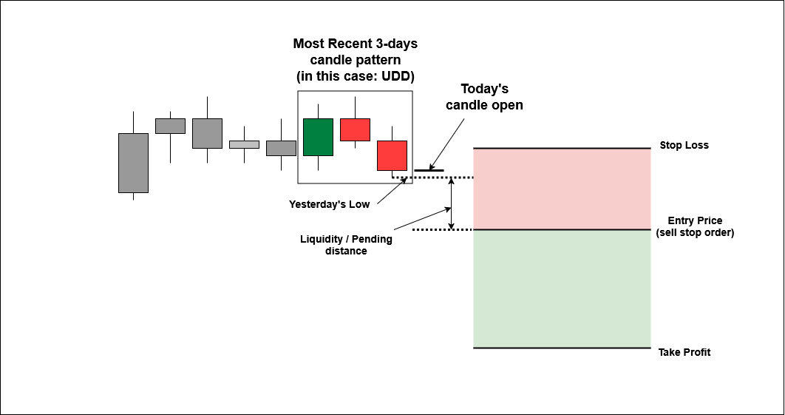

# Trading Strategy Development Example
--- Part 4 ---

Previous Section (part 1): [Basic Understanding of Markov Chain in Financial Market](https://github.com/handiko/Markov-Chain-In-Financial-Market/blob/main/README.md)

Previous Section (part 2): [Using Markov chain to analyze first insight of a forex pair, index, or any market](https://github.com/handiko/Markov-Chain-UpDown-Day/blob/main/README.md)

Previous Section (part 3): [Using a Markov chain to determine market risk](https://github.com/handiko/Markov-Chain-In-Financial-Market-Risk/blob/main/README.md)

---

In this article, we'll develop a real-world trading strategy based on the insights from our Markov Chain study. The strategy presented is a live trading strategy that I personally use, with only minor parameter differences from my own settings.

## Disclaimer !!!
**You shouldn't follow this strategy, as I can't guarantee its future performance**. The phenomenon of **_alpha decay_**—the natural decline in a trading algorithm's effectiveness over time—is a well-documented reality that you should be aware of.

**I ran the strategy across several forex pairs and indices, and each market has its own setting tailored to its market characteristics**. You cannot only rely on one pair/market and hope it will constantly print money. Each market has its own period of several consecutive losses, even though in the long run it still delivers positive results. By deploying the strategy on several markets, any consecutive loss period would be covered by profits from other markets.

I have simplified the strategy code in this article to make the underlying logic easier to understand. These code snippets are suitable for backtesting and optimization but require additional programming before they can be deployed in a live trading environment.

---

## Basic Setup
The strategy is straightforward: we place a buy stop or sell stop order above or below yesterday's high or low, with an added pending distance to mitigate false breakouts and price whipsaws. The activation of a buy or sell stop order serves as self-confirmation, signaling that the price has cleared the volatility area and is likely to continue in the direction of the underlying major trend.

To manage risk, an order expiration timer is set. If the order isn't triggered within its specified lifespan, we assume the trend has not materialized, and the order is deleted in preparation for the next signal.

Only one buy stop and one sell stop order are active at any given time. For simplicity, this article utilizes a fixed lot size risk management approach, risking 1% of the initial margin balance per trade.

### Buy Stop Setup
For the buy position, the rules are as follows:
1. Runs on the Daily (D1) timeframe.
2. The most recent past three days have the same candle sequence as the picked pattern (in the picture below is UDU, meaning Up-Down-Up days)
3. Find yesterday's high.
4. Add the pending distance in points to yesterday's high. This is our entry (buy stop order) price.
5. Subtract the stop loss distance in points from the entry price. This is our stop loss price.
6. Add the stop loss distance in points times the reward-to-risk ratio to our entry price. This is our take-profit price.
7. Set an expiration timer in hours for the order.


### Sell Stop Setup
For the sell position, the rules are as follows (reverse of the buy stop rules):
1. Runs on the Daily (D1) timeframe.
2. The most recent past three days have the same candle sequence as the picked pattern (in the picture below is UDD, meaning Up-Down-Down days)
3. Find yesterday's low.
4. Subtract the pending distance in points from yesterday's low. This is our entry (sell stop order) price.
5. Add the stop loss distance in points to the entry price. This is our stop loss price.
6. Subtract the stop loss distance in points times the reward-to-risk ratio from our entry price. This is our take-profit price.
7. Set an expiration timer in hours for the order.



In this article, we will develop this strategy for the USDJPY forex pair and run it on the D1 timeframe.

---

## MQL5 Code
The MQL5 code in this article is built using the Object-Oriented Programming (OOP) paradigm. The trading strategy is encapsulated within a class, and the main program initializes separate instances of this class for each buy and sell signal. This approach allows each instance to have unique parameters and operate independently. The class definition is located in the [CandlePatternBreakout.mqh](https://github.com/handiko/Trading-Strategy-Development-Example/blob/main/MQL5/CandlePatternBreakout.mqh) file, while the strategy itself is executed from the [Candle Pattern Breakout - USDJPY.mq5](https://github.com/handiko/Trading-Strategy-Development-Example/blob/main/MQL5/Candle%20Pattern%20Breakout%20-%20USDJPY.mq5) file.

### Enumerations
To simplify the code, I've created two enumerations. The first defines the trading direction. Specifying whether the strategy should execute buy orders, sell orders, or both. The second enumeration categorizes specific candle sequences (e.g., UUU, UUD, UDU) for signal generation.

```mql5
enum ENUM_DIRECTION_MODE {
     BUY_ONLY,
     SELL_ONLY,
     BUY_AND_SELL
};

enum ENUM_CANDLE_PATTERN {
     UUU,
     UUD,
     UDU,
     UDD,
     DUU,
     DUD,
     DDU,
     DDD
};
```

### Buy Signal - Code Snippet
The buy signal operates precisely as described above. It identifies the required candle sequence pattern, determines yesterday's high, calculates the entry, Take-Profit (TP), and Stop-Loss (SL) prices, and sets an expiration period for the order.
```mql5
//+------------------------------------------------------------------+
//|                                                                  |
//+------------------------------------------------------------------+
double CandlePatternBreakout::findBuySignal() {
     ENUM_CANDLE_PATTERN cp;
     double high;
     bool candle[3];

     for(int i = 0; i < 3; i++) {
          candle[i] = (iClose(Pair, Timeframe, i + 1) > iOpen(Pair, Timeframe, i + 1)) ? true : false;
     }

     if(candle[2] && candle[1] && candle[0]) {
          cp = UUU;
     } else if(candle[2] && candle[1] && !candle[0]) {
          cp = UUD;
     } else if(candle[2] && !candle[1] && candle[0]) {
          cp = UDU;
     } else if(candle[2] && !candle[1] && !candle[0]) {
          cp = UDD;
     } else if(!candle[2] && candle[1] && candle[0]) {
          cp = DUU;
     } else if(!candle[2] && candle[1] && !candle[0]) {
          cp = DUD;
     } else if(!candle[2] && !candle[1] && candle[0]) {
          cp = DDU;
     } else {
          cp = DDD;
     }

     high = iHigh(Pair, Timeframe, 1);
     if(cp == Pattern) {
          return high;
     }

     return -1;
}

//+------------------------------------------------------------------+
//|                                                                  |
//+------------------------------------------------------------------+
void CandlePatternBreakout::executeBuy(double entry) {
     entry = NormalizeDouble(entry + LiquidityDist * pairPoint, pairDigits);

     double ask = SymbolInfoDouble(Pair, SYMBOL_ASK);
     if(ask > entry) return;

     double tp = entry + TakeProfit * pairPoint;
     tp = NormalizeDouble(tp, pairDigits);

     double sl = entry - StopLoss * pairPoint;
     sl = NormalizeDouble(sl, pairDigits);

     double lots = Lots;

     datetime expiration = iTime(Pair, Timeframe, 0) + ExpirationHours * PeriodSeconds(PERIOD_H1) - PeriodSeconds(PERIOD_M5);

     trade.BuyStop(lots, entry, Pair, sl, tp, ORDER_TIME_SPECIFIED, expiration);

     buyPos = trade.ResultOrder();
}
```

### Sell Signal - Code Snippet
The sell signal functions in the same manner. It identifies the required candle sequence pattern, determines yesterday's low, calculates the entry, Take-Profit (TP), and Stop-Loss (SL) prices, and sets the order's expiration period.
```mql5
//+------------------------------------------------------------------+
//|                                                                  |
//+------------------------------------------------------------------+
double CandlePatternBreakout::findSellSignal() {
     ENUM_CANDLE_PATTERN cp;
     double low;
     bool candle[3];

     for(int i = 0; i < 3; i++) {
          candle[i] = (iClose(Pair, Timeframe, i + 1) > iOpen(Pair, Timeframe, i + 1)) ? true : false;
     }

     if(candle[2] && candle[1] && candle[0]) {
          cp = UUU;
     } else if(candle[2] && candle[1] && !candle[0]) {
          cp = UUD;
     } else if(candle[2] && !candle[1] && candle[0]) {
          cp = UDU;
     } else if(candle[2] && !candle[1] && !candle[0]) {
          cp = UDD;
     } else if(!candle[2] && candle[1] && candle[0]) {
          cp = DUU;
     } else if(!candle[2] && candle[1] && !candle[0]) {
          cp = DUD;
     } else if(!candle[2] && !candle[1] && candle[0]) {
          cp = DDU;
     } else {
          cp = DDD;
     }

     low = iLow(Pair, Timeframe, 1);
     if(cp == Pattern) {
          return low;
     }

     return -1;
}

//+------------------------------------------------------------------+
//|                                                                  |
//+------------------------------------------------------------------+
void CandlePatternBreakout::executeSell(double entry) {
     entry = NormalizeDouble(entry - LiquidityDist * pairPoint, pairDigits);

     double bid = SymbolInfoDouble(Pair, SYMBOL_BID);
     if(bid < entry) return;

     double tp = entry - TakeProfit * pairPoint;
     tp = NormalizeDouble(tp, pairDigits);

     double sl = entry + StopLoss * pairPoint;
     sl = NormalizeDouble(sl, pairDigits);

     double lots = Lots;

     datetime expiration = iTime(Pair, Timeframe, 0) + ExpirationHours * PeriodSeconds(PERIOD_H1) - PeriodSeconds(PERIOD_M5);

     trade.SellStop(lots, entry, Pair, sl, tp, ORDER_TIME_SPECIFIED, expiration);

     sellPos = trade.ResultOrder();
}
```

### OnTick Event - Code Snippet
In MQL5, the OnTick event is a handler that executes every time a new price tick arrives. While it can serve as the "heartbeat" for a trading strategy, our code instead uses a "new candle event" to trigger its logic within the OnTickEvent function. This means the strategy's evaluation and signal generation run only once at the opening of a new day's candle on the D1 timeframe, basing its analysis on the latest complete market data.
```mql5
void CandlePatternBreakout::OnTickEvent() {
     processPos(buyPos);
     processPos(sellPos);

     if(MarketOpenHours(Pair)) {
          int bars = iBars(Pair, Timeframe);
          if(totalBars != bars) {
               totalBars = bars;

               TakeProfit = (int)(StopLoss * RewardToRisk);

               if((DirectionMode == BUY_ONLY) || (DirectionMode == BUY_AND_SELL)) {
                    if(buyPos <= 0) {
                         double high = findBuySignal();
                         if(high > 0) {
                              executeBuy(high);
                         }
                    }
               }

               if((DirectionMode == SELL_ONLY) || (DirectionMode == BUY_AND_SELL)) {
                    if(sellPos <= 0) {
                         double low = findSellSignal();
                         if(low > 0) {
                              executeSell(low);
                         }
                    }
               }
          }
     }
}
```

### Trading Strategy - Complete Code
The complete strategy code provided below includes the optimized parameters. The optimization process itself is detailed in the following paragraph.

```mql5
#include "CandlePatternBreakout.mqh"

input group "General Settings"
static input int InpMagic = 1999;                     // Magic Number
input int InpExpirationHours = 60;                    // Expiration Hours
input double InpLot = 1.0;                            // Lot (fixed)

input group "Buy Breakout Settings"
input int InpPendingDist1 = 200;                      // Liquidity Distance (points)
input ENUM_CANDLE_PATTERN InpPattern1 = UDD;          // Candle Pattern
input double InpRewardToRisk1 = 1.4;                  // Reward to Risk Ratio
input int InpStopLoss1 = 850;                         // StopLoss (points)

input group "Sell Breakout Settings"
input int InpPendingDist2 = 250;                      // Liquidity Distance (points)
input ENUM_CANDLE_PATTERN InpPattern2 = UDD;          // Candle Pattern
input double InpRewardToRisk2 = 0.8;                  // Reward to Risk Ratio
input int InpStopLoss2 = 450;                         // StopLoss (points)

//+------------------------------------------------------------------+
//|                                                                  |
//+------------------------------------------------------------------+
CandlePatternBreakout buystop("USDJPY", InpLot, InpPendingDist1, InpPattern1, InpRewardToRisk1,
                              InpStopLoss1, PERIOD_D1, InpExpirationHours, InpMagic + 1, BUY_ONLY);

//+------------------------------------------------------------------+
//|                                                                  |
//+------------------------------------------------------------------+
CandlePatternBreakout sellstop("USDJPY", InpLot, InpPendingDist2, InpPattern2, InpRewardToRisk2,
                               InpStopLoss2, PERIOD_D1, InpExpirationHours, InpMagic + 2, SELL_ONLY);

//+------------------------------------------------------------------+
//| Expert initialization function                                   |
//+------------------------------------------------------------------+
int OnInit() {
     buystop.OnInitEvent();
     sellstop.OnInitEvent();

     return(INIT_SUCCEEDED);
}

//+------------------------------------------------------------------+
//| Expert deinitialization function                                 |
//+------------------------------------------------------------------+
void OnDeinit(const int reason) {
     buystop.OnDeinitEvent(reason);
     sellstop.OnDeinitEvent(reason);
}

//+------------------------------------------------------------------+
//| Expert tick function                                             |
//+------------------------------------------------------------------+
void OnTick() {
     buystop.OnTickEvent();
     sellstop.OnTickEvent();
}
//+------------------------------------------------------------------+
```

## Backtesting and Parameters Optimization
There are 5 parameters to be set and optimized for each market. They are:
1. Candle Sequence Pattern: (UUU, UUD, UDU, UDD, etc..),
2. Pending (liquidity) distance in points,
3. Stop loss distance in points,
4. Reward-to-Risk ratio, and
5. Order Expiration in hours.

Parameter optimization is a critical step in developing a robust trading strategy. The process involves systematically refining a strategy's settings to achieve optimal performance, while mitigating the risk of overfitting. Overfitting occurs when a model is excessively tailored to historical data, mistaking random noise for genuine patterns, which leads to poor performance in live trading.

### Optimization Methodology

The optimization process is divided into two distinct phases to ensure the strategy's effectiveness and minimize overfitting:

* Initial Parameter Values: Initial values for parameters are not set randomly. They are derived from prior knowledge, such as manual chart analysis, backtesting experience, or previous studies. These foundational values are crucial, as they significantly influence the success of the optimization process. Without a reasonable starting point, the optimization is more likely to yield overfitted results that are susceptible to rapid alpha decay—the natural decline of an algorithmic strategy's performance over time.
* In-Sample and Out-of-Sample Testing: The optimization process uses a bifurcated approach to data.
1. In-Sample (Training) Data: This is a historical data set (e.g., 5 years) used to train and optimize the strategy's parameters. Parameters 1-4 are optimized independently for buy and sell positions, while parameter 5 is a common parameter optimized after the others are finalized.
2. Out-of-Sample (Testing) Data: This is a separate, unseen data set (e.g., 1-2 years) used to validate the results from the in-sample optimization. The ideal ratio is for the in-sample period to be roughly three times the length of the out-of-sample period.

The final set of parameters is chosen based on its performance across both data sets, ensuring the strategy is robust and not merely a result of chance.

### Statistical Significance

During the optimization process, it's essential to ensure the results are statistically significant. A key rule of thumb is that the number of trades generated must be at least 10 times the number of free parameters. In this case, with four free parameters, the strategy should produce a minimum of 40 trades during the training period to provide a reliable basis for evaluation.

### The Art of Optimization

Choosing the length of the training data is an important consideration. The data set must be long enough to capture long-term market patterns, yet not so long that the captured patterns are no longer relevant to current market conditions. A training period that is too short may lead to the optimization process focusing on market noise rather than meaningful underlying trends.


## Walk-Forward Optimization (Periodic Re-Optimization)
Due to the inherent simplicity of the presented trading strategy, it may not adequately adapt to evolving market conditions. Since financial markets are dynamic, a fixed strategy is susceptible to alpha decay, a decline in performance over time. A practical solution to this challenge is periodic re-optimization, commonly known as walk-forward optimization.

Walk-forward optimization involves a cyclical process of backtesting and parameter optimization that is performed at regular intervals. This approach ensures the strategy remains relevant and adapts to recent market behavior.

The process can be broken down into these steps:
1. Initial Deployment: The strategy is trained on an initial in-sample dataset (e.g., 2018-2023) and validated on an out-of-sample test set (e.g., 2023 to mid-2024). It is then deployed for a specific period, such as six months, in a live trading environment.
2. Periodic Retraining: After the initial live trading period, the strategy is retrained with a new, shifted dataset. For example, the new in-sample data would cover mid-2018 to mid-2023, with a new test set from mid-2023 to 2025. The strategy is then redeployed for another six months.
3. Continuous Cycle: This cycle of retraining and redeployment continues, with the datasets progressively shifting forward to incorporate the most recent market data.

This method allows the strategy to capture the most current market patterns. While it doesn't eliminate the risk of overfitting, consistent periodic retraining helps the strategy remain adaptable and robust over the long term.


## Backtest Result from The Strategy Above
The strategy is backtested on the USDJPY forex pair, D1 timeframe, from 2019-01-01, using price data from Tickmill-Live


### Conclusion
The provided trading strategy, while simple in its logic, is designed to generate a sequence of trades based on a Markov Chain study. However, a fixed strategy like this is vulnerable to alpha decay as market conditions evolve. To counter this, walk-forward optimization can be implemented. This process involves periodically re-optimizing the strategy's parameters with recent market data. By consistently adapting the strategy's settings, walk-forward optimization ensures it remains aligned with current market behavior, thereby sustaining its performance over time.

---

MQL5 Codes included in this article:
1. [Candle Pattern Breakout - USDJPY.mq5](https://github.com/handiko/Trading-Strategy-Development-Example/blob/main/MQL5/Candle%20Pattern%20Breakout%20-%20USDJPY.mq5)
2. [CandlePatternBreakout.mqh - Strategy Class](https://github.com/handiko/Trading-Strategy-Development-Example/blob/main/MQL5/CandlePatternBreakout.mqh)
3. [main.mqh - basic library](https://github.com/handiko/Trading-Strategy-Development-Example/blob/main/MQL5/main.mqh)
4. [StandardIncludes.mqh - other functions](https://github.com/handiko/Trading-Strategy-Development-Example/blob/main/MQL5/StandardIncludes.mqh)

---

Next Section (part 5): [Trading Strategy Improvement](https://github.com/handiko/Improvement-to-an-existing-strategy/blob/main/README.md)
