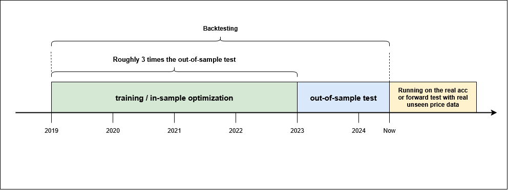

# Trading Strategy Development Example

Continuing the discussion from the previous sections, in this article, we will develop a real trading strategy inspired by the Markov Chain study results. The trading strategy presented in this article, I actually use it personally on my real trading account. There are some minor parameter differences from my personal settings, but overall, it is actually very much the same. 

---

## Disclaimer !!!
**I do not recommend that anybody follow my strategy, as I cannot guarantee this strategy will continue to deliver positive results in the future**. **_Alpha-decay_** (the decay of an algorithmic trading performance) is a real phenomenon, and you should know about it.

**I ran the strategy across several forex pairs and indices, and each market has its own setting tailored to its market characteristics**. You cannot only rely on one pair/market and hope it will constantly print money. Each market has its own period of several consecutive losses, even though in the long run it still delivers positive results. By deploying the strategy on several markets, any consecutive loss period would be covered by profits from other markets.

One more thing, all of the strategy codes presented in this article are the simplified versions of what I am using right now. The simplifications are made to ease the understanding of the underlying logic behind the strategy.

---

## Basic Setup
The idea is simple: by picking one candle sequence pattern from the Markov Chain study, we will put a buy stop or sell stop order above or below yesterday's high or low, plus some "pending distance" to account for the possibility of price whipsaw or false break. I use buy and sell stop order as a self-confirmation. If the buy or sell stop is triggered, then I assume the price has already cleared the whipsaw/false break area and would continue to move further in the direction of our trade (**following the underlying major trend**). Furthermore, I set an order-expiration timer. If the order is not triggered within the order's lifetime window, then I assume the trend has failed to materialize, and the order has to be deleted and then move on to find the next buy or sell signal.
I only open one buy stop and one sell stop at a time (no multiple orders in the same direction). For simplicity, in this article, we use fixed lot risk management as much as 1% of the initial margin balance.

### Buy Stop Setup
For the buy position, the rules are as follows:
1. Runs on the Daily (D1) timeframe.
2. The most recent past three days have the same candle sequence as the picked pattern (in the picture below is UDU, meaning Up-Down-Up days)
3. Find yesterday's high.
4. Add the pending distance in points to yesterday's high. This is our entry (buy stop order) price.
5. Subtract the stop loss distance in points from the entry price. This is our stop loss price.
6. Add the stop loss distance in points times the reward-to-risk ratio to our entry price. This is our take-profit price.
7. Set an expiration timer in hours for the order.


### Sell Stop Setup
For the sell position, the rules are as follows (reverse of the buy stop rules):
1. Runs on the Daily (D1) timeframe.
2. The most recent past three days have the same candle sequence as the picked pattern (in the picture below is UDD, meaning Up-Down-Down days)
3. Find yesterday's low.
4. Subtract the pending distance in points from yesterday's low. This is our entry (sell stop order) price.
5. Add the stop loss distance in points to the entry price. This is our stop loss price.
6. Subtract the stop loss distance in points times the reward-to-risk ratio from our entry price. This is our take-profit price.
7. Set an expiration timer in hours for the order.


In this article, we will develop this strategy for the USDJPY forex pair and run it on the D1 timeframe.

---

## MQL5 Code
The MQL5 codes developed in this article use the OOP (Object-Oriented Programming) paradigm. The strategy is written into a class, and the actual trading strategy code would then initialize an instance of this class for each buy and sell trading direction. Using this technique, each instance would have different parameters and run independently from each other. The class definition of this strategy is described in the "CandlePatternBreakout.mqh" file, and the actual trading strategy is run on the "Candle Pattern Breakout - USDJPY.mq5" file. 

### Definitions
Two enumerations are written to ease the code writing. The Enums described here are about the trading direction (either buy only, sell only, or both buy and sell), and candle pattern (UUU, UUD, UDU, etc..)
```mql5
enum ENUM_DIRECTION_MODE {
     BUY_ONLY,
     SELL_ONLY,
     BUY_AND_SELL
};

enum ENUM_CANDLE_PATTERN {
     UUU,
     UUD,
     UDU,
     UDD,
     DUU,
     DUD,
     DDU,
     DDD
};
```

### Buy Signal - Code Snippet
The buy signal is exactly as described above. It seeks the required candle sequence pattern, finds yesterday's high, calculates the entry, TP, and SL price, and then sets the expiration period.
```mql5
//+------------------------------------------------------------------+
//|                                                                  |
//+------------------------------------------------------------------+
double CandlePatternBreakout::findBuySignal() {
     ENUM_CANDLE_PATTERN cp;
     double high;
     bool candle[3];

     for(int i = 0; i < 3; i++) {
          candle[i] = (iClose(Pair, Timeframe, i + 1) > iOpen(Pair, Timeframe, i + 1)) ? true : false;
     }

     if(candle[2] && candle[1] && candle[0]) {
          cp = UUU;
     } else if(candle[2] && candle[1] && !candle[0]) {
          cp = UUD;
     } else if(candle[2] && !candle[1] && candle[0]) {
          cp = UDU;
     } else if(candle[2] && !candle[1] && !candle[0]) {
          cp = UDD;
     } else if(!candle[2] && candle[1] && candle[0]) {
          cp = DUU;
     } else if(!candle[2] && candle[1] && !candle[0]) {
          cp = DUD;
     } else if(!candle[2] && !candle[1] && candle[0]) {
          cp = DDU;
     } else {
          cp = DDD;
     }

     high = iHigh(Pair, Timeframe, 1);
     if(cp == Pattern) {
          return high;
     }

     return -1;
}

//+------------------------------------------------------------------+
//|                                                                  |
//+------------------------------------------------------------------+
void CandlePatternBreakout::executeBuy(double entry) {
     entry = NormalizeDouble(entry + LiquidityDist * pairPoint, pairDigits);

     double ask = SymbolInfoDouble(Pair, SYMBOL_ASK);
     if(ask > entry) return;

     double tp = entry + TakeProfit * pairPoint;
     tp = NormalizeDouble(tp, pairDigits);

     double sl = entry - StopLoss * pairPoint;
     sl = NormalizeDouble(sl, pairDigits);

     double lots = Lots;

     datetime expiration = iTime(Pair, Timeframe, 0) + ExpirationHours * PeriodSeconds(PERIOD_H1) - PeriodSeconds(PERIOD_M5);

     trade.BuyStop(lots, entry, Pair, sl, tp, ORDER_TIME_SPECIFIED, expiration);

     buyPos = trade.ResultOrder();
}
```

### Sell Signal - Code Snippet
The sell signal is exactly as described above as well. It seeks the required candle sequence pattern, finds yesterday's low, calculates the entry, TP, and SL price, and then sets the expiration period.
```mql5
//+------------------------------------------------------------------+
//|                                                                  |
//+------------------------------------------------------------------+
double CandlePatternBreakout::findSellSignal() {
     ENUM_CANDLE_PATTERN cp;
     double low;
     bool candle[3];

     for(int i = 0; i < 3; i++) {
          candle[i] = (iClose(Pair, Timeframe, i + 1) > iOpen(Pair, Timeframe, i + 1)) ? true : false;
     }

     if(candle[2] && candle[1] && candle[0]) {
          cp = UUU;
     } else if(candle[2] && candle[1] && !candle[0]) {
          cp = UUD;
     } else if(candle[2] && !candle[1] && candle[0]) {
          cp = UDU;
     } else if(candle[2] && !candle[1] && !candle[0]) {
          cp = UDD;
     } else if(!candle[2] && candle[1] && candle[0]) {
          cp = DUU;
     } else if(!candle[2] && candle[1] && !candle[0]) {
          cp = DUD;
     } else if(!candle[2] && !candle[1] && candle[0]) {
          cp = DDU;
     } else {
          cp = DDD;
     }

     low = iLow(Pair, Timeframe, 1);
     if(cp == Pattern) {
          return low;
     }

     return -1;
}

//+------------------------------------------------------------------+
//|                                                                  |
//+------------------------------------------------------------------+
void CandlePatternBreakout::executeSell(double entry) {
     entry = NormalizeDouble(entry - LiquidityDist * pairPoint, pairDigits);

     double bid = SymbolInfoDouble(Pair, SYMBOL_BID);
     if(bid < entry) return;

     double tp = entry - TakeProfit * pairPoint;
     tp = NormalizeDouble(tp, pairDigits);

     double sl = entry + StopLoss * pairPoint;
     sl = NormalizeDouble(sl, pairDigits);

     double lots = Lots;

     datetime expiration = iTime(Pair, Timeframe, 0) + ExpirationHours * PeriodSeconds(PERIOD_H1) - PeriodSeconds(PERIOD_M5);

     trade.SellStop(lots, entry, Pair, sl, tp, ORDER_TIME_SPECIFIED, expiration);

     sellPos = trade.ResultOrder();
}
```

### OnTick Event - Code Snippet
OnTick Event on MQL5 or MetaTrader is an event which called if there is a new price delivery event is happening (ie, price tick). This function is commonly used for the "heartbeat" that runs the trading strategy. In this code, we are using the "new candle event" (ie, the opening of the new day's candle on D1 timeframe) to run the evaluation, which finds the buy or sell signal based on the current data.
```mql5
void CandlePatternBreakout::OnTickEvent() {
     processPos(buyPos);
     processPos(sellPos);

     if(MarketOpenHours(Pair)) {
          int bars = iBars(Pair, Timeframe);
          if(totalBars != bars) {
               totalBars = bars;

               TakeProfit = (int)(StopLoss * RewardToRisk);

               if((DirectionMode == BUY_ONLY) || (DirectionMode == BUY_AND_SELL)) {
                    if(buyPos <= 0) {
                         double high = findBuySignal();
                         if(high > 0) {
                              executeBuy(high);
                         }
                    }
               }

               if((DirectionMode == SELL_ONLY) || (DirectionMode == BUY_AND_SELL)) {
                    if(sellPos <= 0) {
                         double low = findSellSignal();
                         if(low > 0) {
                              executeSell(low);
                         }
                    }
               }
          }
     }
}
```

### Trading Strategy - Complete Code
The complete code of the strategy below is the code with parameters after optimization. The optimization processes are described in the next paragraph below.

```mql5
#include "CandlePatternBreakout.mqh"

input group "General Settings"
static input int InpMagic = 1999;                     // Magic Number
input int InpExpirationHours = 60;                    // Expiration Hours
input double InpLot = 1.0;                            // Lot (fixed)

input group "Buy Breakout Settings"
input int InpPendingDist1 = 200;                      // Liquidity Distance (points)
input ENUM_CANDLE_PATTERN InpPattern1 = UDD;          // Candle Pattern
input double InpRewardToRisk1 = 1.4;                  // Reward to Risk Ratio
input int InpStopLoss1 = 850;                         // StopLoss (points)

input group "Sell Breakout Settings"
input int InpPendingDist2 = 250;                      // Liquidity Distance (points)
input ENUM_CANDLE_PATTERN InpPattern2 = UDD;          // Candle Pattern
input double InpRewardToRisk2 = 0.8;                  // Reward to Risk Ratio
input int InpStopLoss2 = 450;                         // StopLoss (points)

//+------------------------------------------------------------------+
//|                                                                  |
//+------------------------------------------------------------------+
CandlePatternBreakout buystop("USDJPY", InpLot, InpPendingDist1, InpPattern1, InpRewardToRisk1,
                              InpStopLoss1, PERIOD_D1, InpExpirationHours, InpMagic + 1, BUY_ONLY);

//+------------------------------------------------------------------+
//|                                                                  |
//+------------------------------------------------------------------+
CandlePatternBreakout sellstop("USDJPY", InpLot, InpPendingDist2, InpPattern2, InpRewardToRisk2,
                               InpStopLoss2, PERIOD_D1, InpExpirationHours, InpMagic + 2, SELL_ONLY);

//+------------------------------------------------------------------+
//| Expert initialization function                                   |
//+------------------------------------------------------------------+
int OnInit() {
     buystop.OnInitEvent();
     sellstop.OnInitEvent();

     return(INIT_SUCCEEDED);
}

//+------------------------------------------------------------------+
//| Expert deinitialization function                                 |
//+------------------------------------------------------------------+
void OnDeinit(const int reason) {
     buystop.OnDeinitEvent(reason);
     sellstop.OnDeinitEvent(reason);
}

//+------------------------------------------------------------------+
//| Expert tick function                                             |
//+------------------------------------------------------------------+
void OnTick() {
     buystop.OnTickEvent();
     sellstop.OnTickEvent();
}
//+------------------------------------------------------------------+
```

## Backtesting and Parameters Optimization
There are 5 parameters to be set and optimized for each market. They are:
1. Candle Sequence Pattern: (UUU, UUD, UDU, UDD, etc..),
2. Pending (liquidity) distance in points,
3. Stop loss distance in points,
4. Reward-to-Risk ratio, and
5. Order Expiration in hours.

Parameters 1-to-4 are independently optimized for buy and sell positions, but parameter 5 is a common parameter for both buy and sell positions. It is to be optimized after the buy and sell parameters are finished from the optimization steps.

Initial parameter values are usually derived from manual visual inspection of the chart (ie, to determine how many points are likely to be required for SL and TP distances), from experience, or from other data and prior studies. These initial parameter values are mostly the biggest factor that determines the success of finding the optimal values for each parameter. If the initial values are set without any prior knowledge or without any reasonable foundations, the optimized values are likely to overfit and lead to faster alpha-decay.

The optimization steps are divided into two parts:
1. Optimize the parameters with the prior price data of a certain period, called **training data or in-sample data**. For example, a period of 5 years.
2. The best sets of parameter values are then to be re-evaluated with unseen price data of a certain period, called **test data or out-of-sample data**. For example, a period of 1-to-2 years.
3. The period of in-sample data should be roughly 3 times the out-of-sample data to achieve a balance between the long duration of training data and the rather large duration of test data.
4. The set of parameter values that perform well on both datasets is then chosen as the final parameter values.

There is an "art" in the optimization process. We should pick a longer training data period to capture the longer-lasting underlying pattern, but not too long so that the captured pattern is still relevant to today's market conditions. If the training data is too short, the optimization process is likely to capture noise that the underlying pattern itself.

The important thing is that, during the optimization with training data, the parameter value set should generate enough trading data so that the results are statistically significant. The rule of thumb is that the trading data should be at least 10 times the number of free parameters. In this case, with 4 free parameters (parameter 1-to-4), we need to see at least 40 trading data points to be generated during the iteration.



## Walk-Forward Optimization (Periodic Re-Optimization)
As the trading strategy presented in this article is rather simple, any characteristic change that happens in the market would likely not be factored into the strategy. The financial market is not static and continues to evolve. Therefore, if the trading strategy is set to be fixed, it could lead to the diminishing of trading performance (alpha-decay). One practical and easy solution to these problems is periodic re-optimization or walk-forward optimization.

Walk-forward optimization is basically running the backtesting and parameter optimization periodically after the strategy is run on the real account or real forward testing.
Example of a walk-forward optimization with a re-opt period of 6 months:
1. The strategy is trained with in-sample data from 2018 to 2023. Test data is from 2023 to mid-2024. After that, the strategy is deployed in a real account for six months.
2. 6 months later, the strategy is retrained with in-sample data from mid-2018 to mid-2023. Test data is from mid-2023 to 2025. After that, the strategy is redeployed in a real account for six months.
3. Again, 6 months later, the strategy is retrained with in-sample data from 2019 to 2024. Test data is from 2024 to mid-2025. And-so-on ...

With this scheme, the trading strategy would capture the most recent underlying pattern that is relevant to today's market environment. Even though the overfitting risk is not completely gone, at least with consistent periodic re-training, the strategy should consistently adapt itself.


